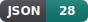
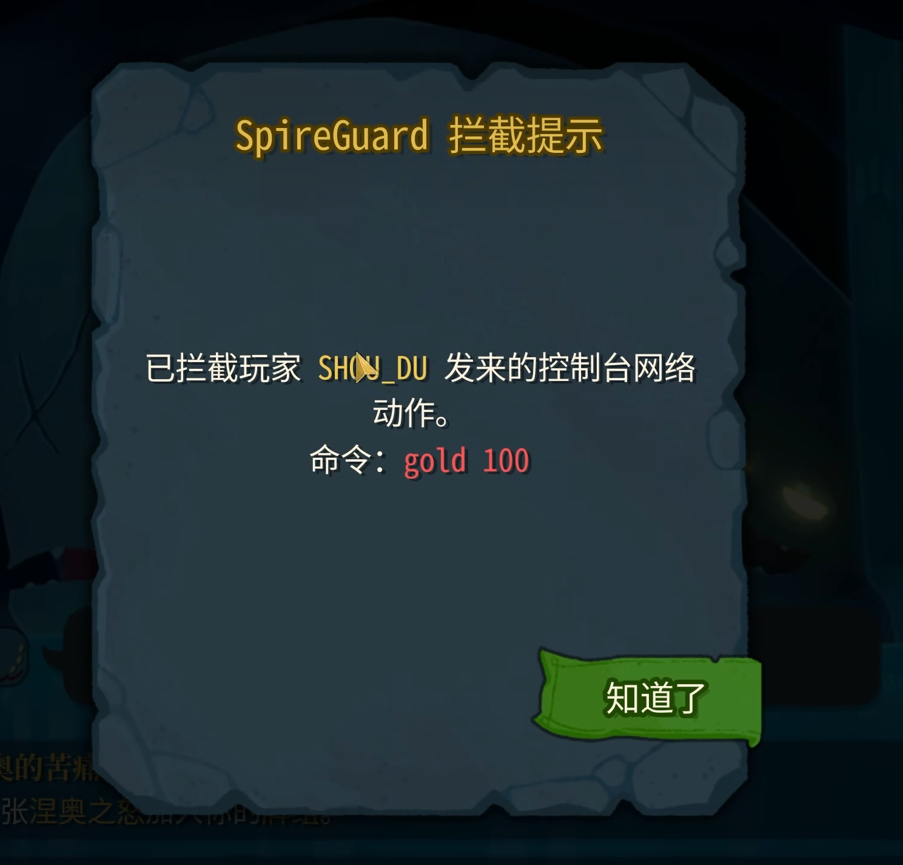
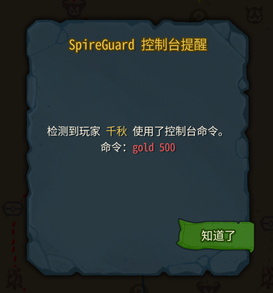
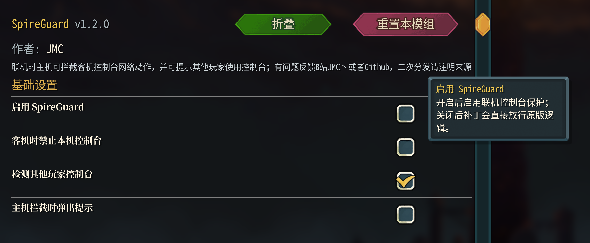

<p align="center">
  <a href="README.md"></a>
  <a href="README_en.md"></a>
  <a href="CHANGELOG.md"></a>
  <a href="https://github.com/JMC2002/SlayTheSpire2_SpireGuard/releases"></a>
<!-- code-stats:start -->
  <a href="https://github.com/JMC2002/SlayTheSpire2_SpireGuard/actions/workflows/code-lines.yml"></a>
  <a href="https://github.com/JMC2002/SlayTheSpire2_SpireGuard/actions/workflows/code-lines.yml"></a>
  <a href="https://github.com/JMC2002/SlayTheSpire2_SpireGuard/actions/workflows/code-lines.yml"></a>
  <a href="https://github.com/JMC2002/SlayTheSpire2_SpireGuard/actions/workflows/code-lines.yml"></a>
  <a href="https://github.com/JMC2002/SlayTheSpire2_SpireGuard/actions/workflows/code-lines.yml"></a>
  <a href="https://github.com/JMC2002/SlayTheSpire2_SpireGuard/actions/workflows/code-lines.yml"></a>
  <a href="https://github.com/JMC2002/SlayTheSpire2_SpireGuard/actions/workflows/code-lines.yml"></a>
<!-- code-stats:end -->
</p>

# SpireGuard
##  0. 安装

### Mod本体安装
Steam版本直接在创意工坊订阅即可（暂未开放）

其他版本可以自行编译，或者在[📦 Releases](https://github.com/JMC2002/SlayTheSpire2_SpireGuard/releases)界面下载.zip后解压到游戏安装目录下的Mods
目录下（没有就新建一个）

### 前置安装
**此外，本模组强依赖于模组[JmcModLib](https://github.com/JMC2002/SlayTheSpire2_JmcModLib/releases)**，安装方法同上

安装完成后的目录结构如下：

```sh
-- Slay the Spire 2
    |-- SlayTheSpire2.exe
        |-- mods
             |-- JmcModLib
             |-- SpireGuard
                  |-- SpireGuard.dll
                  |-- SpireGuard.pck
                  |-- SpireGuard.json
```

### 存档迁移
> 当你第一次安装MOD，游戏会默认将开启Mod的存档与没开启的隔离，可以按下面的方法迁移存档：

在安装好MOD后第一次打开游戏会询问是否启用MOD，启用并再次打开游戏一次后，退出游戏，将`%appdata%\SlayTheSpire2\steam\`下面的数字文件夹下的你对应的存档文件粘贴到该文件夹的`modded`文件夹中，以同步使用MOD前后的存档

---
## 🧠 1. 简介
联机时总是有队友偷偷开控制台？用这个MOD来解决吧！（本机安装即可）

[演示视频（B站）](https://www.bilibili.com/video/BV1CXdPBZE8D)

[Github仓库](https://github.com/JMC2002/SlayTheSpire2_SpireGuard)
## ⚙️ 2. 功能
- 主机打开功能后，当客机使用控制台命令或者基于控制台命令的MOD时，主机会进行拦截，并给主机弹窗提醒，哪位玩家使用了什么命令。

- 作为客机对拦截无能为力，但是可以监测谁发出了什么命令

- 可以设置功能的开启与关闭

 
## 🔔 3. 提醒
- **本模组强依赖于模组[JmcModLib](https://github.com/JMC2002/SlayTheSpire2_JmcModLib/releases)**
- 作为客机安装时，只能检测已经同步到本机的其他玩家控制台动作，无法替未安装的主机拦截其他玩家。
 
## 🧩 4. 兼容性
- 由于游戏处于EA阶段，可能会随着游戏版本更新而失效

## 🧭 5. TODO
- 根据后续游戏版本变化继续跟进控制台和联机同步入口。

**如果你喜欢这个 Mod 的话，希望可以点一个star~**
